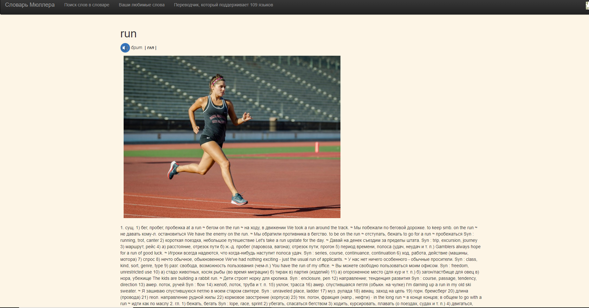
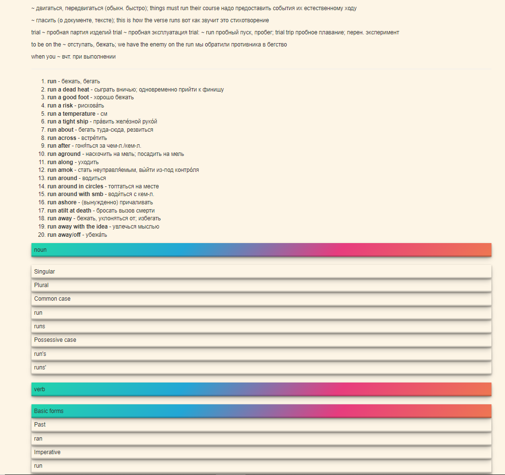
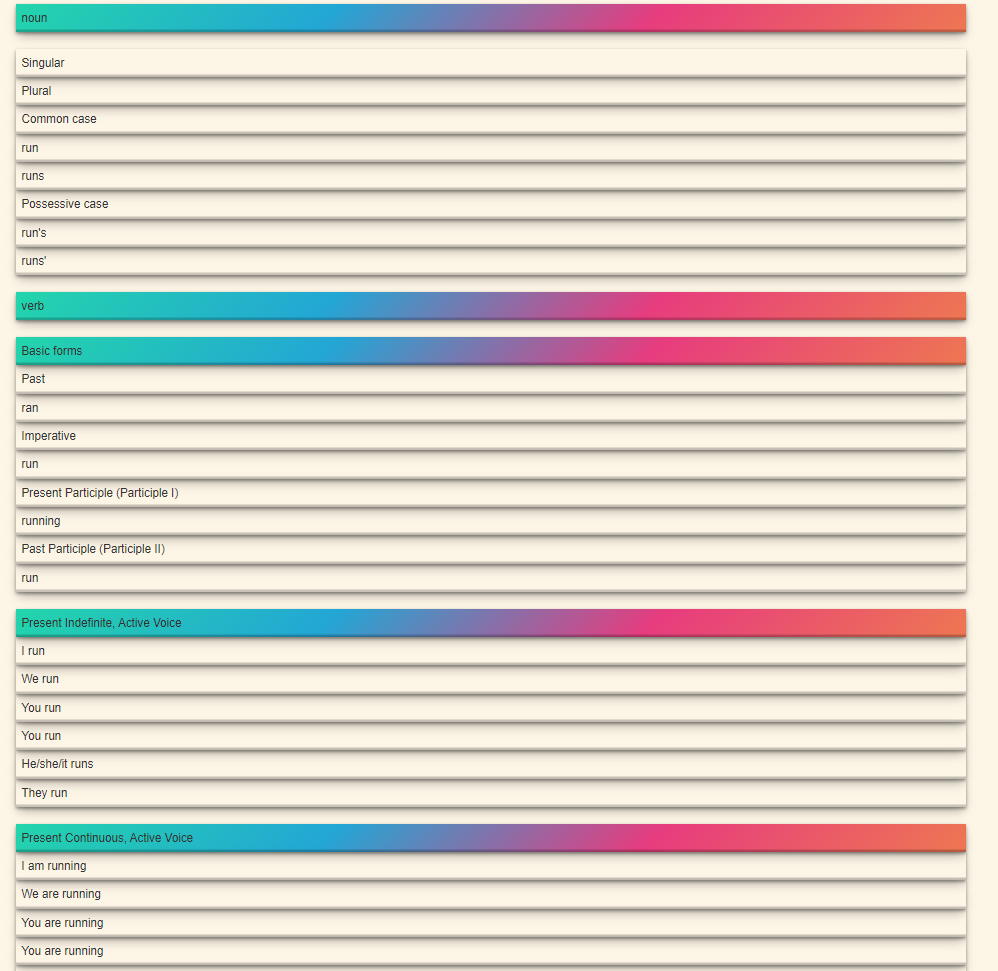
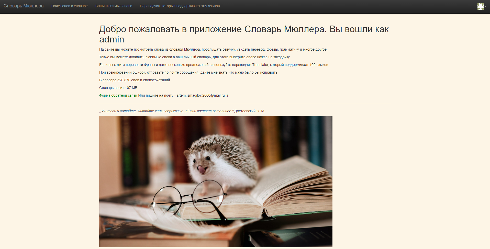
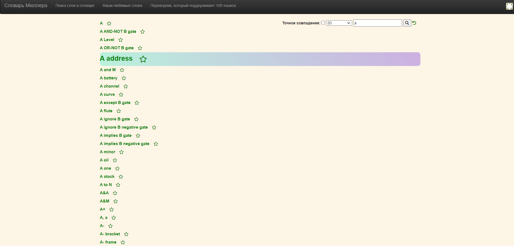
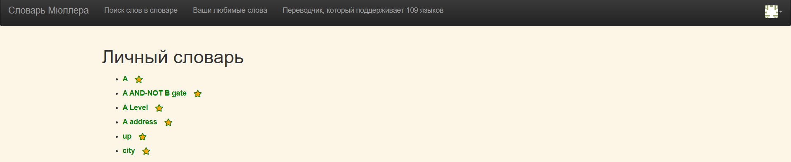
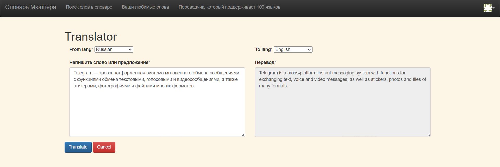
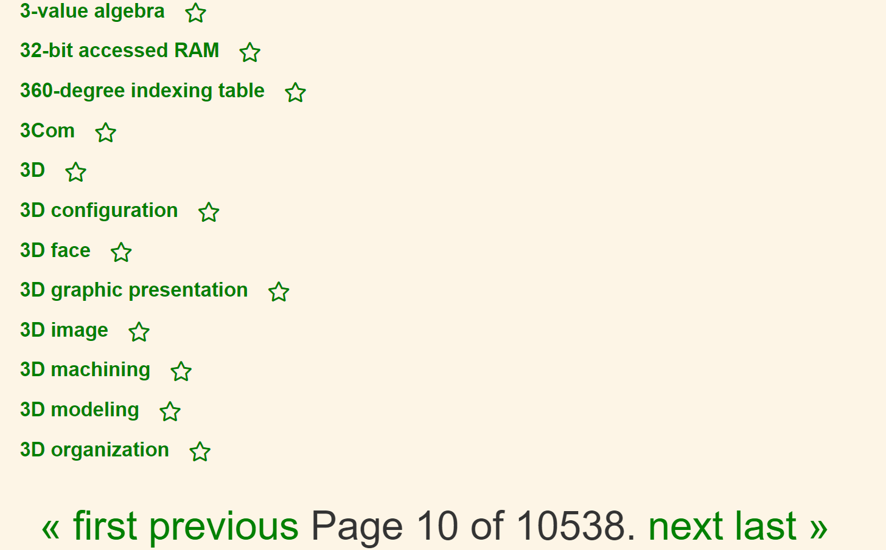

# Словарь Мюллера

## Возможности проекта

- Поиск слов по словарю Мюллера с фильтрацией, ограничением по количеству и учётом точного совпадения
- Просмотр информации о словах с таблицей времен
- Озвучка слов и картинка
- Зарегистрированным пользователям можно закрепить слова нажав на звёздочку
- Есть переводчик, который поддерживает 109 языков

1. Клонируем проект
    ```bash
   git clone https://github.com/ArtemIsmagilov/mysite.git
   cd /mysite
    ```
2. Создаем виртуальное окружение и устанавливаем необходимые пакеты
    ```bash
   python3 -m venv venv
   source venv/bin/activate
    ```
3. Создаем файл `.env` и заполняем необходимые переменные по примеру `.example.env`
   - Lingvo API https://developers.lingvolive.com/en-us/Help
4. Создаем миграции и применяем их
   - python manage.py makemigrations
   - python manage.py migrate
5. Чтобы посмотреть возможность добавления и удаления любимых слов требуется регистрация, поэтому либо регистрируемся как
   админ, либо как обычный пользователь.
   ```bash
   python3 manage.py createsuperuser
   ```
6. Добавляем словарь Мюллера в БД
7. - Здесь представлено несколько словарей http://dicto.org.ru/xdxf.html , скачать по ссылке 
   [English-Russian full dictionary](http://downloads.sourceforge.net/xdxf/comn_sdict05_eng_rus_full.tar.bz2)
   - Необходимо скачать XML файл слов в папку /mysite/words/words_scripts/
   - запускаем скрипт для добавления слов
   ```bash
   python3 ./words/words_scripts/loading.py run
   ```
8. Стартуем
   ```bash
   python3 manage.py runserver
   ```
   
## Скриншоты

- 
- 
- 
- 
- 
- 
- 
- 
